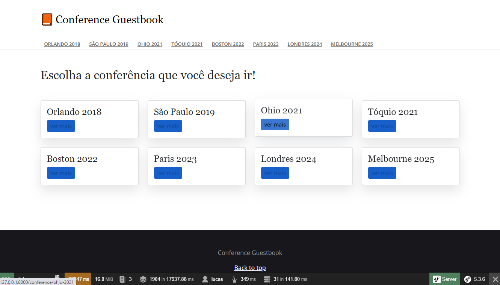

<h1 align="center">
    
</h1>

 

## 💻 Projeto

Projeto de cadastro de conferências desenvolvido em PHP utilizando a documentação do framework Symfony. 

## 🚀 Tecnologias

Tecnologias Utilizadas neste projeto: 

- [PHP](https://www.php.net/)
- [Symfony](https://symfony.com/)
- [Docker](https://www.docker.com/)
- [PostgreSql](https://www.postgresql.org/)

## 📝 License

Esse projeto está sob a licença MIT. Veja o arquivo [LICENSE](LICENSE.md) para mais detalhes.

---

Em desenvolvimento, por Lucas Lima.
